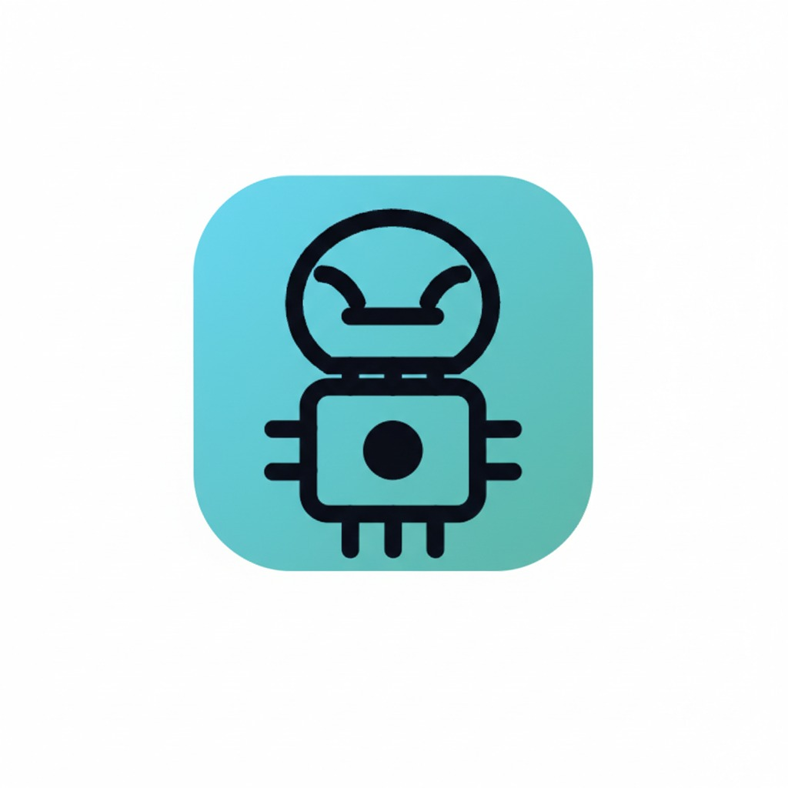
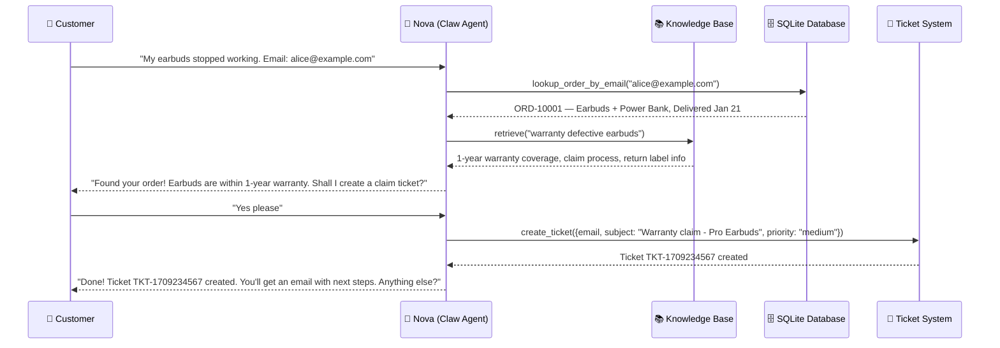
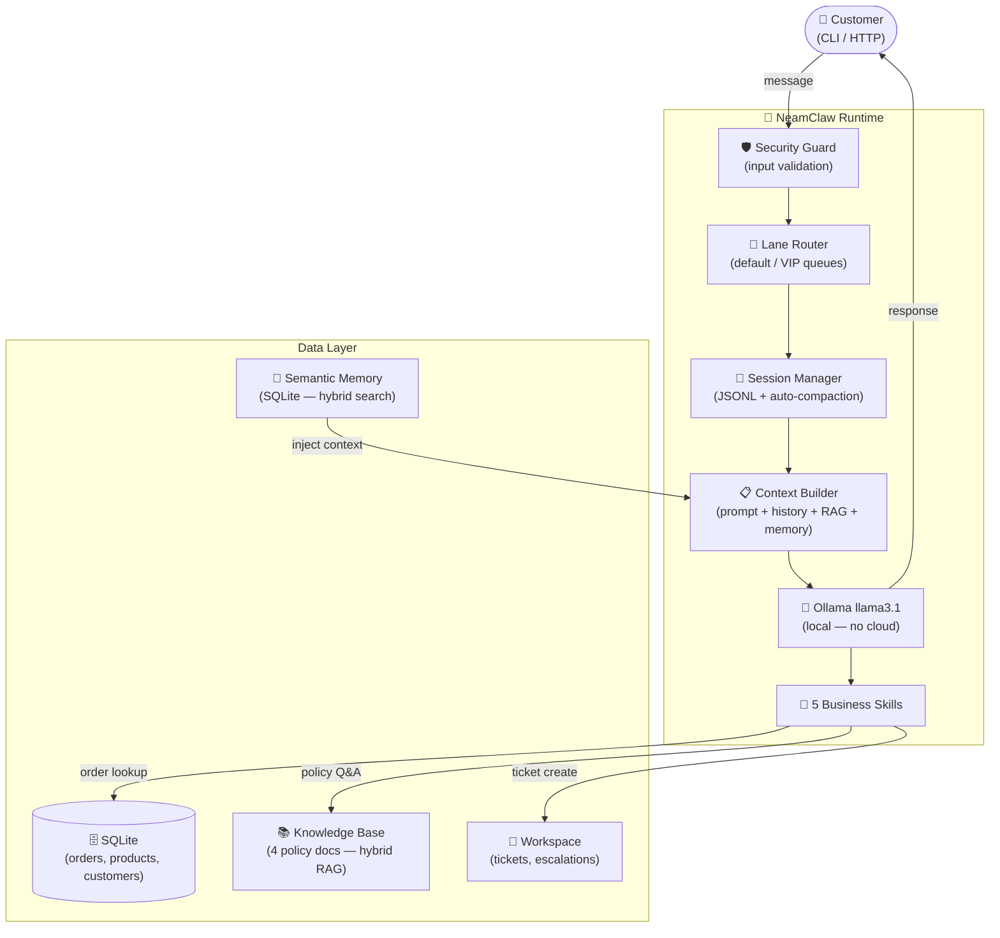

<div align="center">



<br/>

https://github.com/samsuljahith/neamclaw-support-bot/raw/master/assets/neam-robot.mp4

# TechNova Support Bot

### Built with Neam's Claw Agent — Local AI, Zero Cloud API Cost

[](https://github.com/neam-lang/neam)
[](https://ollama.com)
[](LICENSE)

> **An AI-powered customer support agent for e-commerce — persistent, context-aware, business-smart. Built in 273 lines of Neam.**

> **Zero cloud API costs.** Runs entirely on your own hardware using Ollama. You pay for your machine and electricity — not per token, not per call, not per month to any AI provider.

</div>

---

## The Business Problem

> "Every customer support ticket costs **$5–$15** when handled by humans. During peak seasons, queues stretch **hours**. Existing chatbots? Rigid, expensive, or clueless about your business."

| Pain Point | Real Cost |
|---|---|
| Human agents per interaction | $5–$15 per conversation |
| Peak season wait times | 2–8 hours |
| Cloud AI APIs (GPT-4, Claude) | $2–$25 per 1M tokens |
| Stateless bots that forget context | Customers repeat themselves every message |
| Bots with no business data | Can't look up orders, check stock, create tickets |
| No safety guardrails | Escalations happen incorrectly or at wrong times |

Small and mid-size e-commerce businesses can't afford 24/7 support teams — but they also can't afford to lose customers to long waits and robotic responses.

---

## How I Solved It with Neam

I used **Neam's Claw Agent** — a persistent, conversational agent type — to build a support bot that:

- **Knows your business**: Hybrid RAG knowledge base with your actual FAQ, return policy, shipping info, and warranty docs
- **Remembers context**: JSONL session storage that survives server restarts and auto-compacts at 80% token budget
- **Calls real tools**: 5 skills that query your actual SQLite database (orders, products, customers)
- **Runs locally for free**: Ollama + llama3.1 — no cloud API costs, ever
- **Handles traffic**: Concurrency lanes for default and VIP priority queues

**Result: A support agent with $0/month in cloud AI costs (vs. $500+/month for GPT-4/Claude APIs) that handles unlimited conversations 24/7 — running on hardware you already own.**

---

## How It Works — Live Conversation



---

## System Architecture



---

## 5 Business Skills Powering Nova

| Skill | What It Does | Business Value |
|---|---|---|
| `lookup_order` | Find order status, tracking number, delivery dates | Resolve "where's my order?" in seconds |
| `lookup_order_by_email` | Find all orders for a customer email | Full order history without asking for IDs |
| `create_ticket` | Open a support ticket for unresolved issues | Structured follow-up, nothing falls through |
| `check_product` | Check stock levels and pricing | Answer "is this in stock?" with live data |
| `escalate_to_human` | Hand off to a human agent (**sensitive — requires approval**) | Safe escalation with human-in-the-loop |

---

## The Claw Agent in Neam

The entire support system lives in **273 lines** of Neam:

```neam
// 1. RAG Knowledge Base — your real business documents
knowledge SupportKB {
  vector_store:       "usearch"
  embedding_model:    "nomic-embed-text"
  retrieval_strategy: "hybrid"     // BM25 + vector search combined
  top_k:              4
  sources: [faq.md, return_policy.md, shipping_info.md, warranty.md]
}

// 2. Persistent Claw Agent
claw agent support_bot {
  provider:            "ollama"
  model:               "llama3.1"
  connected_knowledge: [SupportKB]

  // Persistent conversation memory
  session: {
    storage:            "jsonl"
    idle_reset_minutes: 30
    max_history_turns:  60
  }

  // Long-term fact retention across sessions
  semantic_memory: {
    backend:          "sqlite"
    search:           "hybrid"
    flush_on_compact: true    // extract facts before summarization
  }

  channels: [cli, { http: { port: 8080 } }]

  // Priority queues
  lanes: [
    { name: "default", concurrency: 4 }
    { name: "vip",     concurrency: 2, priority: "high" }
  ]
}
```

---

## Business Impact

| Metric | Before | With Nova (Neam) |
|---|---|---|
| Cost per interaction | $5–$15 | **$0 cloud API cost** (runs on your hardware) |
| Response time | 2–8 hours | **< 2 seconds** |
| Availability | Business hours | **24/7 / 365** |
| Conversation memory | Agent must re-ask every time | **Full persistent history** |
| Policy knowledge | Requires staff training | **Instant via RAG** |
| Order lookup | Human searches manually | **Automatic via skill** |
| Monthly cloud AI cost | $500+ (GPT-4 / Claude API) | **$0 — no cloud API used** |
| Infrastructure cost | Variable | Hardware + electricity you already own |

---

## Quick Start

### Docker (Recommended)

```bash
git clone https://github.com/samsuljahith/neamclaw-support-bot.git
cd neamclaw-support-bot

cp .env.example .env
docker compose up --build
# First run pulls llama3.1 (~4.7 GB) — takes 5–10 minutes

# Test it:
curl -X POST http://localhost:8080/api/v1/claw/support_bot/sessions/test/message \
  -H "Content-Type: application/json" \
  -H "Authorization: Bearer dev-key-change-me" \
  -d '{"message": "What is your return policy?"}'
```

### Local Setup

```bash
git clone https://github.com/samsuljahith/neamclaw-support-bot.git
cd neamclaw-support-bot

ollama pull llama3.1 && ollama pull nomic-embed-text
sqlite3 ./data/technova.db < ./data/seed.sql

neamc support_bot.neam -o support_bot.neamb
neam support_bot.neamb          # CLI mode
# OR
neam-api --program support_bot.neamb --port 8080   # HTTP mode
```

---

## Project Structure

```
neamclaw-support-bot/
├── support_bot.neam          # Complete agent — 273 lines
├── data/
│   ├── seed.sql              # 5 customers, 10 products, 7 orders
│   ├── faq.md                # 20+ Q&A pairs
│   ├── return_policy.md      # 30-day return policy
│   ├── shipping_info.md      # Domestic + 40-country shipping rates
│   └── warranty.md           # 1-year warranty terms + claim process
├── docker-compose.yml        # Ollama + bot (one-command setup)
├── Dockerfile                # Multi-stage build
├── .env.example
└── README.md
```

---

## Neam Concepts Demonstrated

| Neam Concept | What It Does in This Project |
|---|---|
| `claw agent` | Persistent conversational agent type |
| `knowledge` + `hybrid` RAG | Policy Q&A from real business documents |
| `skill` with `sensitive: true` | Human-approval gate before escalation |
| `session` (JSONL) | Conversation memory that survives restarts |
| `semantic_memory` | Long-term fact retention across sessions |
| `flush_on_compact` | Extract facts before summarization — nothing lost |
| `lanes` | Priority queues — VIP customers get faster responses |
| `connected_knowledge` | RAG context injected into every LLM call |
| `impl Schedulable` | 5-minute heartbeat to monitor ticket directory |
| `impl Monitorable` | Detects escalation spikes (>5/hour triggers alert) |
| `impl Sandboxable` | Strict mode — network, filesystem, memory restricted |

---

## API Endpoints

| Method | Endpoint | Description |
|---|---|---|
| `GET` | `/health` | Health check (no auth) |
| `POST` | `/api/v1/claw/support_bot/sessions/{key}/message` | Send message to Nova |
| `POST` | `/api/v1/claw/support_bot/sessions/{key}/reset` | Reset conversation |
| `POST` | `/api/v1/claw/support_bot/compact` | Trigger manual compaction |
| `GET` | `/api/v1/metrics` | Runtime metrics |

---

## License

MIT License

---

Built with the [Neam programming language](https://github.com/neam-lang/neam) · Powered by [Ollama](https://ollama.com) · Guided by [Praveen Govindaraj](https://github.com/Praveengovianalytics)
