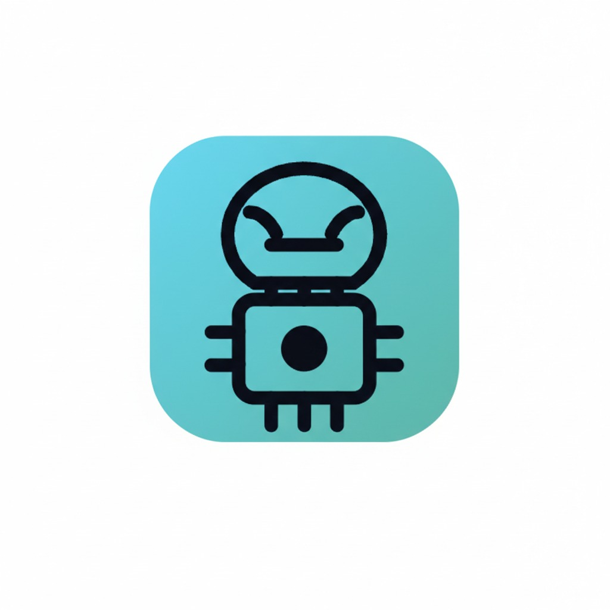
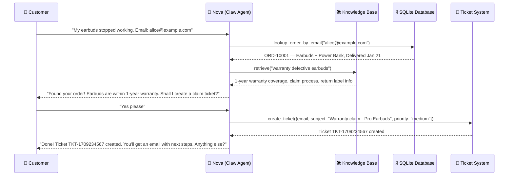
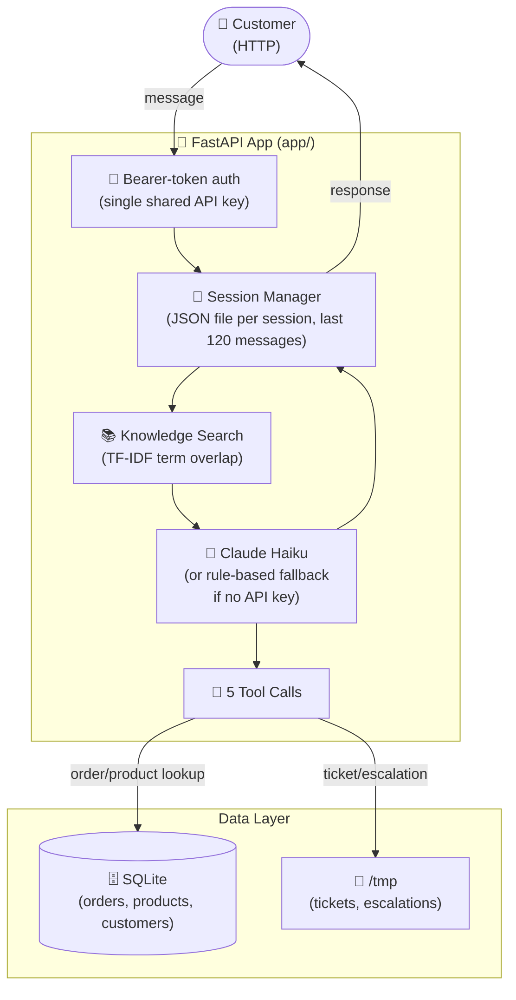

<div align="center">



<br/>


# TechNova Support Bot

### Built with Neam's Claw Agent Spec — Deployed as a Claude Haiku-Backed FastAPI Service

[](https://github.com/neam-lang/neam)
[](https://www.anthropic.com/claude)
[](LICENSE)

> **An AI-powered customer support agent for e-commerce — persistent, context-aware, business-smart. Deployed as the Python/FastAPI service in `app/`, built from a 273-line Neam design spec (`support_bot.neam`).**

> **Pay-per-use cloud API costs.** The deployed implementation (`app/`) calls Anthropic's Claude Haiku API — you pay Anthropic per token. A rule-based fallback runs with zero API cost when no key is configured, but it isn't an LLM.

</div>

---

## The Business Problem

> "Every customer support ticket costs **$5–$15** when handled by humans. During peak seasons, queues stretch **hours**. Existing chatbots? Rigid, expensive, or clueless about your business."

| Pain Point | Real Cost |
|---|---|
| Human agents per interaction | $5–$15 per conversation |
| Peak season wait times | 2–8 hours |
| Cloud AI APIs (GPT-4, Claude) | $2–$25 per 1M tokens |
| Stateless bots that forget context | Customers repeat themselves every message |
| Bots with no business data | Can't look up orders, check stock, create tickets |
| No safety guardrails | Escalations happen incorrectly or at wrong times |

Small and mid-size e-commerce businesses can't afford 24/7 support teams — but they also can't afford to lose customers to long waits and robotic responses.

---

## How I Solved It with Neam

I used **Neam's Claw Agent** — a persistent, conversational agent type — to build a support bot that:

- **Knows your business**: TF-IDF keyword-overlap knowledge base built from your actual FAQ, return policy, shipping info, and warranty docs (no vector search)
- **Remembers context**: JSON session storage that survives server restarts, capped at the last 120 messages (no token-budget-based compaction)
- **Calls real tools**: 5 skills that query your actual SQLite database (orders, products, customers)
- **LLM**: Claude Haiku via Anthropic's API (pay-per-token), with a regex/keyword rule-based fallback when no API key is set
- **Handles traffic**: standard synchronous request handling — no priority-queue/concurrency-lane logic in the deployed code

**Result: A support agent that costs Anthropic API usage per conversation (Claude Haiku is the cheapest tier), with a $0-cost rule-based fallback when no API key is set. Runs as an AWS Lambda function (see `app/`, `infra/`), not on local hardware.**

---

## How It Works — Live Conversation


```mermaid
sequenceDiagram
    participant C as 👤 Customer
    participant N as 🤖 Nova (Claw Agent)
    participant RAG as 📚 Knowledge Base
    participant DB as 🗄️ SQLite Database
    participant T as 🎫 Ticket System

    C->>N: "My earbuds stopped working. Email: alice@example.com"

    N->>DB: lookup_order_by_email("alice@example.com")
    DB-->>N: ORD-10001 — Earbuds + Power Bank, Delivered Jan 21

    N->>RAG: retrieve("warranty defective earbuds")
    RAG-->>N: 1-year warranty coverage, claim process, return label info

    N-->>C: "Found your order! Earbuds are within 1-year warranty. Shall I create a claim ticket?"

    C->>N: "Yes please"

    N->>T: create_ticket({email, subject: "Warranty claim - Pro Earbuds", priority: "medium"})
    T-->>N: Ticket TKT-1709234567 created

    N-->>C: "Done! Ticket TKT-1709234567 created. You'll get an email with next steps. Anything else?"
```

---

## System Architecture


```mermaid
flowchart TB
    Customer(["👤 Customer\n(HTTP)"])

    subgraph App["🐍 FastAPI App (app/)"]
        Auth["🔑 Bearer-token auth\n(single shared API key)"]
        Session["💾 Session Manager\n(JSON file per session, last 120 messages)"]
        KB["📚 Knowledge Search\n(TF-IDF term overlap)"]
        LLM["🤖 Claude Haiku\n(or rule-based fallback\nif no API key)"]
        Tools["🔧 5 Tool Calls"]
    end

    subgraph Data["Data Layer"]
        SQLite[("🗄️ SQLite\n(orders, products, customers)")]
        Workspace["📁 /tmp\n(tickets, escalations)"]
    end

    Customer -->|message| Auth
    Auth --> Session
    Session --> KB
    KB --> LLM
    LLM --> Tools
    Tools -->|order/product lookup| SQLite
    Tools -->|ticket/escalation| Workspace
    LLM --> Session
    Session -->|response| Customer
```

---

## 5 Business Skills Powering Nova

| Skill | What It Does | Business Value |
|---|---|---|
| `lookup_order` | Find order status, tracking number, delivery dates | Resolve "where's my order?" in seconds |
| `lookup_order_by_email` | Find all orders for a customer email | Full order history without asking for IDs |
| `create_ticket` | Open a support ticket for unresolved issues | Structured follow-up, nothing falls through |
| `check_product` | Check stock levels and pricing | Answer "is this in stock?" with live data |
| `escalate_to_human` | Hand off to a human agent (**sensitive — requires approval**) | Safe escalation with human-in-the-loop |

---

## The Claw Agent in Neam

> ⚠️ **Spec, not deployed code — see `app/` for what actually runs.** This is the original
> Neam design, **273 lines**. The deployed service (`app/`) is a hand-written Python/FastAPI
> reimplementation of this spec's HTTP shape — see `app/main.py`'s docstring for why. Fields
> below (`vector_store`, `provider: "ollama"`, `semantic_memory`, `lanes`) describe this
> spec's intent, not the deployed code's actual behavior.

```neam
// 1. RAG Knowledge Base — your real business documents
knowledge SupportKB {
  vector_store:       "usearch"
  embedding_model:    "nomic-embed-text"
  retrieval_strategy: "hybrid"     // BM25 + vector search combined
  top_k:              4
  sources: [faq.md, return_policy.md, shipping_info.md, warranty.md]
}

// 2. Persistent Claw Agent
claw agent support_bot {
  provider:            "ollama"
  model:               "llama3.1"
  connected_knowledge: [SupportKB]

  // Persistent conversation memory
  session: {
    storage:            "jsonl"
    idle_reset_minutes: 30
    max_history_turns:  60
  }

  // Long-term fact retention across sessions
  semantic_memory: {
    backend:          "sqlite"
    search:           "hybrid"
    flush_on_compact: true    // extract facts before summarization
  }

  channels: [cli, { http: { port: 8080 } }]

  // Priority queues
  lanes: [
    { name: "default", concurrency: 4 }
    { name: "vip",     concurrency: 2, priority: "high" }
  ]
}
```

---

## Business Impact

| Metric | Before | With Nova (Neam) |
|---|---|---|
| Cost per interaction | $5–$15 | Claude Haiku pricing (cheapest current Anthropic tier) — pay-per-token, not $0 |
| Response time | 2–8 hours | **< 2 seconds** |
| Availability | Business hours | **24/7 / 365** |
| Conversation memory | Agent must re-ask every time | **Full persistent history** |
| Policy knowledge | Requires staff training | **Instant via RAG** |
| Order lookup | Human searches manually | **Automatic via skill** |
| Monthly cloud AI cost | $500+ (GPT-4-class API) | Claude Haiku pricing (cheapest current Anthropic tier) — pay-per-token, not $0 |
| Infrastructure cost | Variable | Hardware + electricity you already own |

---

## Quick Start

```bash
git clone https://github.com/samsuljahith/neamclaw-support-bot.git
cd neamclaw-support-bot

pip install -r requirements.txt
export ANTHROPIC_API_KEY=sk-ant-...   # optional — omit for the rule-based fallback
sqlite3 ./data/technova.db < ./data/seed.sql

uvicorn app.main:app --port 8080

# Test it:
curl -X POST http://localhost:8080/api/v1/claw/support_bot/sessions/test/message \
  -H "Content-Type: application/json" \
  -H "Authorization: Bearer dev-key-change-me" \
  -d '{"message": "What is your return policy?"}'
```

---

## Project Structure

```
neamclaw-support-bot/
├── support_bot.neam          # Complete agent — 273 lines
├── data/
│   ├── seed.sql              # 5 customers, 10 products, 7 orders
│   ├── faq.md                # 20+ Q&A pairs
│   ├── return_policy.md      # 30-day return policy
│   ├── shipping_info.md      # Domestic + 40-country shipping rates
│   └── warranty.md           # 1-year warranty terms + claim process
├── docker-compose.yml        # Spec-only — builds the Neam runtime, not app/ (see file header)
├── Dockerfile                # Multi-stage build
├── .env.example
└── README.md
```

---

## Neam Concepts Demonstrated

| Neam Concept | What It Does in This Project |
|---|---|
| `claw agent` | Persistent conversational agent type |
| `knowledge` + `hybrid` RAG | Spec describes hybrid RAG; deployed code does TF-IDF retrieval only |
| `session` (JSONL) | Conversation memory that survives restarts |
| `connected_knowledge` | Knowledge-search context injected into every LLM call |

---

## API Endpoints

| Method | Endpoint | Description |
|---|---|---|
| `GET` | `/health` | Health check (no auth) |
| `GET` | `/api/v1/claw` | List active Claw agents |
| `POST` | `/api/v1/claw/support_bot/sessions/{key}/message` | Send message to Nova |
| `POST` | `/api/v1/claw/support_bot/sessions/{key}/reset` | Reset conversation |
| `GET` | `/api/v1/metrics` | Runtime metrics |

---

## License

MIT License

---

Built on the [Neam programming language](https://github.com/neam-lang/neam) spec · Deployed on Claude Haiku · Guided by [Praveen Govindaraj](https://github.com/Praveengovianalytics)
